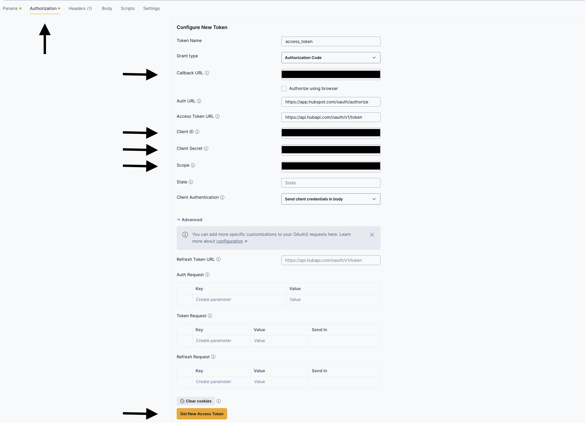
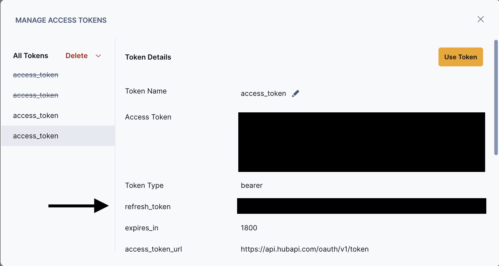

# OAuth2 Refresh Token Hubspot Connector Example

## Connector overview

This connector demonstrates OAuth 2.0 authentication with automatic access token refresh for the HubSpot API. It syncs contacts and companies data from HubSpot to Fivetran using an authorization code–based OAuth2 flow with refresh-token support (access tokens are refreshed using `grant_type=refresh_token`).
This example supports cases where the refresh token has no time-to-live (TTL), and only the access token is refreshed using it. If you need to programmatically update configuration values (such as refresh tokens) during the sync, refer to the [`update_configuration_during_sync` example](https://github.com/fivetran/fivetran_connector_sdk/tree/main/examples/common_patterns_for_connectors/update_configuration_during_sync).

Note: We offer a [Fivetran native HubSpot connector](https://fivetran.com/docs/connectors/applications/hubspot#hubspot) you can deploy in your dashboard. 

## Requirements

- [Supported Python versions](https://github.com/fivetran/fivetran_connector_sdk/blob/main/README.md#requirements)

- Operating system:
  - Windows: 10 or later (64-bit only)
  - macOS: 13 (Ventura) or later (Apple Silicon [arm64] or Intel [x86_64])
  - Linux: Distributions such as Ubuntu 20.04 or later, Debian 10 or later, or Amazon Linux 2 or later (arm64 or x86_64)

## Getting started

Refer to the [Connector SDK Setup Guide](https://fivetran.com/docs/connectors/connector-sdk/setup-guide)  to get started.

## Features

- OAuth 2.0 authentication with automatic access token refresh
- Syncs contacts from HubSpot API
- Syncs companies from HubSpot API
- Pagination support for large datasets
- Example state tracking for last sync timestamp

## Configuration file

The connector requires the following configuration parameters:

```json
{
  "refresh_token": "<YOUR_REFRESH_TOKEN>",
  "client_secret": "<YOUR_CLIENT_SECRET>",
  "client_id": "<YOUR_CLIENT_ID>"
}
```
Parameters:
  - `refresh_token` (required) – The OAuth2 refresh token used to obtain new access tokens when the current access token expires.
  - `client_id` (required) – The OAuth2 client ID from your HubSpot application.
  - `client_secret` (required) – The OAuth2 client secret from your HubSpot application.

Note: Ensure that the configuration.json file is not checked into version control to protect sensitive information.

## Requirements file

Note: The `fivetran_connector_sdk:latest` and `requests:latest` packages are pre-installed in the Fivetran environment. To avoid dependency conflicts, do not declare them in your `requirements.txt`.

## Authentication

### Obtaining HubSpot OAuth2 credentials

1. If you don't have a HubSpot account, [create one](https://developers.hubspot.com/docs/guides/apps/public-apps/overview) 

2. Create a developer account and a HubSpot app with scopes and redirect URL. See HubSpot's [OAuth documentations](https://developers.hubspot.com/docs/reference/api/app-management/oauth) for details.

3. Paste the `ClientID`, `Client Secret` and `Redirect URL` values from the developer account in the corresponding fields on the `Authorisation` tab in Postman:
   

4. Fetch the refresh token:

   i. Click `Get new access Token`. A developer sign-in popup will appear.

   ii. Log in to your developer account and click Authorize to grant access to the redirect URL. The popup will close, and you should see a window displaying your tokens.
      

5. Access the [HubSpot API collection](https://developers.hubspot.com/docs/reference/api/crm/objects).

## Pagination

The connector implements cursor-based pagination to retrieve large datasets in batches. It uses a while loop that continues fetching data until the API's `has-more` flag returns false. For each request, the connector passes an offset parameter that the API returns in the previous response, allowing it to resume from the exact position in the dataset.

Response limits per request:
- Contacts – 100 records (using `vidOffset` parameter)
- Companies – 250 records (using `offset` parameter)

Refer to `sync_contacts(configuration, cursor)`, `sync_companies(configuration, cursor)`

## Data handling

The connector transforms raw HubSpot API responses into structured records through the following process:

- Extraction – Navigates nested JSON structures using `get()` method with default values for missing fields.
- Validation – Checks that required fields exist before processing (e.g., contacts must have firstname and identity profiles with identities).
- Transformation – Converts nested properties into flat dictionary structures suitable for database storage.
- Upserting – Sends transformed records to Fivetran using `op.upsert()`, which handles both inserts and updates based on primary keys.
- State tracking – Persists sync progress using `op.checkpoint(state)` with the last_updated_at timestamp for incremental syncs.

Refer to `process_record` within `sync_contacts(configuration, cursor)`, `sync_companies(configuration, cursor)`

## Error handling

The connector implements error handling strategies:

- Configuration validation – Ensures all required configuration parameters (refresh_token, client_secret, client_id) are present before processing.
- Access token refresh – Automatically refreshes the access token when it expires by comparing the refresh time with the current time. If token refresh fails, an exception is raised with error details.
- API request errors – Logs severe errors when API requests fail and raises exceptions to stop processing.

Refer to `validate_configuration(configuration: dict)`, `get_access_token(configuration: dict)`, `get_data(method, params, headers, configuration, body=None)`

## Tables created

Summary of tables replicated:

- contacts 
  - Primary key: vid 
  - Columns include vid (LONG), lastmodifieddate (STRING), firstname (STRING), company (STRING), email (STRING).
- companies
  - Primary key: companyId
  - Columns include companyId (LONG), name (STRING), timestamp (LONG).

## Updating the refresh token

- Using Fivetran [Update API](https://fivetran.com/docs/rest-api/api-reference/connectors/modify-connector?service=15five#updateaconnection):

  ```
  PATCH /v1/connections/connectionId HTTP/1.1
  Accept: application/json;version=2
  Authorization: Basic REPLACE_BASIC_AUTH
  Content-Type: application/json
  Host: api.fivetran.com
  Content-Length: 625

  {
    "config": {
      "refresh_token": "updated_refresh_token",
      "client_id": "your_client_id",
      "client_secret": "your_client_secret"
    }
  }
  ```

- Updating manually in [Fivetran dashboard](https://fivetran.com/dashboard/connectors/connection_id/setup) – The configuration passed in configuration.json at the time of deploying the connector can be updated after logging on the fivetran dashboard and navigating to the setup tab.

## Additional files

- constants.py – Stores constant values used throughout the connector, including base URL, authentication URL, contacts URL, company URL, and response limits.

## Additional considerations

The examples provided are intended to help you effectively use Fivetran's Connector SDK. While we've tested the code, Fivetran cannot be held responsible for any unexpected or negative consequences that may arise from using these examples. For inquiries, please reach out to our Support team.
