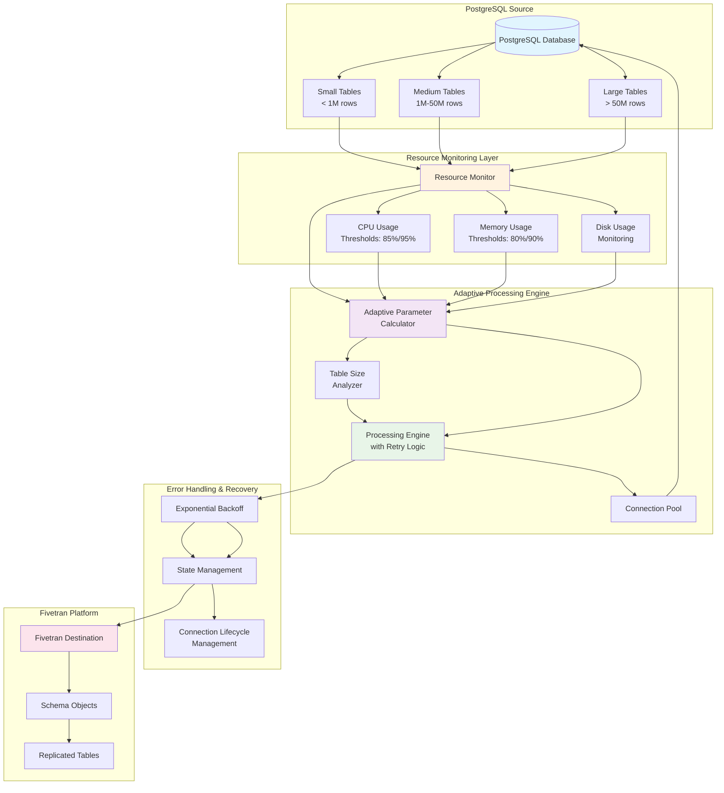

# Fivetran Resource Monitoring Connector

## Connector overview

This Fivetran connector demonstrates advanced resource monitoring and adaptive processing capabilities for PostgreSQL data extraction. The connector intelligently adjusts its processing parameters based on system resource usage and table characteristics to optimize performance and prevent resource exhaustion.

The connector provides enterprise-grade data replication with real-time resource monitoring, automatic parameter adjustment, and intelligent table categorization. It supports dynamic data filtering and includes comprehensive error handling with exponential backoff retry logic.

## Architecture



## Requirements

* [Supported Python versions](https://github.com/fivetran/fivetran_connector_sdk/blob/main/README.md#requirements)   
* Operating system:
  * Windows: 10 or later (64-bit only)
  * macOS: 13 (Ventura) or later (Apple Silicon [arm64] or Intel [x86_64])
  * Linux: Distributions such as Ubuntu 20.04 or later, Debian 10 or later, or Amazon Linux 2 or later (arm64 or x86_64)

## Getting started

Refer to the [Setup Guide](https://fivetran.com/docs/connectors/connector-sdk/setup-guide) to get started.

### Database setup

Before running the connector, you must set up your PostgreSQL database with the required tables and sample data. Follow these steps:

1. Connect to your PostgreSQL database using your preferred client (psql, pgAdmin, etc.)
2. Execute the `setup.sql` file to create the required schema and sample data:

```sql
-- Run the setup script
\i setup.sql
```

The setup script creates:
- Sample business tables (orders, customers, products, suppliers, order_items, inventory)
- Performance indexes for optimal query performance
- Sample data with regional distribution
- Helper functions for data generation
- Analysis views for business intelligence

3. Verify the setup by checking that all tables contain data:

```sql
-- Verify table counts
SELECT 'customers' as table_name, COUNT(*) as record_count FROM customers
UNION ALL
SELECT 'suppliers', COUNT(*) FROM suppliers
UNION ALL
SELECT 'products', COUNT(*) FROM products
UNION ALL
SELECT 'orders', COUNT(*) FROM orders
UNION ALL
SELECT 'order_items', COUNT(*) FROM order_items
UNION ALL
SELECT 'inventory', COUNT(*) FROM inventory
ORDER BY table_name;
```

## Features

* **Resource monitoring** - Real-time monitoring of CPU, memory, and disk usage with automatic parameter adjustment
* **Adaptive processing** - Dynamic batch size and thread count optimization based on table characteristics and system resources
* **Intelligent table categorization** - Automatic classification of tables as small (< 1M rows), medium (1M-50M rows), or large (> 50M rows)
* **Region-based filtering** - Support for filtering data by geographic region
* **Comprehensive error handling** - Exponential backoff retry logic with jitter and connection lifecycle management
* **Performance optimization** - Table size-based processing strategies and memory-efficient data processing

## Configuration file

The connector uses the following configuration keys defined in the `configuration.json` file:

```json
{
  "host": "localhost",
  "port": "5432",
  "database": "postgres",
  "username": "",
  "password": "",
  "region": "North America",
  "max_retries": "5",
  "retry_sleep_seconds": "5",
  "debug": "false",
  "table_filters": "{}",
  "custom_batch_size": "0",
  "custom_threads": "0",
  "custom_queue_size": "0"
}
```

| Parameter | Default | Description |
|-----------|---------|-------------|
| `host` | Required | PostgreSQL server hostname |
| `port` | 5432 | PostgreSQL server port |
| `database` | Required | Database name |
| `username` | Required | Database username |
| `password` | Required | Database password |
| `region` | Required | Target region for data filtering |
| `max_retries` | 5 | Maximum retry attempts for failed operations |
| `retry_sleep_seconds` | 5 | Base delay between retries |
| `debug` | false | Enable debug logging for troubleshooting |
| `table_filters` | {} | JSON object for custom table filtering |
| `custom_batch_size` | 0 | Override adaptive batch size (0 = use adaptive) |
| `custom_threads` | 0 | Override adaptive thread count (0 = use adaptive) |
| `custom_queue_size` | 0 | Override adaptive queue size (0 = use adaptive) |

NOTE: Ensure that the `configuration.json` file is not checked into version control to protect sensitive information.

## Requirements file

The `requirements.txt` file specifies the Python libraries required by the connector:

```
psutil
```

NOTE: The `fivetran_connector_sdk:latest` and `requests:latest` packages are pre-installed in the Fivetran environment. To avoid dependency conflicts, do not declare them in your `requirements.txt`.

## Authentication

The connector uses PostgreSQL database authentication with username and password credentials. You must provide valid database credentials in the configuration file to access the source database.

## Pagination

The connector handles large datasets through adaptive batch processing. It automatically adjusts batch sizes based on table characteristics and system resource usage:

- **Small tables** (< 1M rows): 5,000 records per batch
- **Medium tables** (1M-50M rows): 2,500 records per batch  
- **Large tables** (> 50M rows): 1,000 records per batch

The connector also implements intelligent checkpointing to maintain progress across processing cycles. Refer to the `get_adaptive_batch_size()` function and adaptive parameter calculation in lines 157-192 of `connector.py`.

## Data handling

The connector processes data through several stages:

1. **Resource monitoring** - Continuously monitors CPU, memory, and disk usage using the `monitor_resources()` function
2. **Table analysis** - Categorizes tables by size and determines optimal processing parameters using `categorize_and_sort_tables()`
3. **Adaptive processing** - Adjusts batch sizes and thread counts based on resource pressure using `get_adaptive_parameters_with_monitoring()`
4. **Region filtering** - Filters data based on the configured region parameter in `apply_transformations()`
5. **Transformation** - Applies business logic transformations to the data
6. **Replication** - Delivers processed data to Fivetran destination

The connector automatically collects metadata about tables and columns, including table information (name, schema, type, comments) and column information (name, type, constraints, defaults). Refer to the `schema()` function in lines 444-509 of `connector.py`.

## Error handling

The connector implements comprehensive error handling strategies:

- **Exponential backoff retry logic** - Intelligent retry delays with jitter to prevent thundering herd problems
- **Connection lifecycle management** - 3-hour connection lifetime with automatic reconnection using the `ConnectionManager` class
- **State persistence** - Maintains progress across failures using checkpoints
- **Resource monitoring** - Automatically adjusts processing parameters when resource pressure is detected

Refer to the retry logic in the main `update()` function (lines 784-807) and the `ConnectionManager` class (lines 284-354) for connection lifecycle management.

## Tables Created

The connector replicates the following tables from the PostgreSQL source:

* **POSTGRES_TABLES** - Metadata about database tables
* **POSTGRES_COLUMNS** - Metadata about table columns  
* **SOURCE_FIVETRAN_CONNECTOR_ORDERS** - Order information with regional filtering
* **SOURCE_FIVETRAN_CONNECTOR_CUSTOMERS** - Customer data across multiple regions
* **SOURCE_FIVETRAN_CONNECTOR_PRODUCTS** - Product catalog information
* **SOURCE_FIVETRAN_CONNECTOR_SUPPLIERS** - Supplier information with regional distribution
* **SOURCE_FIVETRAN_CONNECTOR_ORDER_ITEMS** - Order line item details
* **SOURCE_FIVETRAN_CONNECTOR_INVENTORY** - Inventory levels and stock information

The connector also creates several analysis views in the source database:
* **ORDER_SUMMARY_BY_REGION** - Regional order statistics
* **CUSTOMER_ORDER_HISTORY** - Customer purchasing patterns  
* **PRODUCT_PERFORMANCE** - Product sales and inventory metrics

## Additional files

* **setup.sql** - Database setup script that creates required metadata tables, sample business tables, performance indexes, and helper functions for data generation
* **connector.py** - Main connector implementation with resource monitoring and adaptive processing logic
* **configuration.json** - Configuration file containing database connection parameters and processing options
* **requirements.txt** - Python dependencies required for the connector to run

## Additional considerations

The examples provided are intended to help you effectively use Fivetran's Connector SDK. While we've tested the code, Fivetran cannot be held responsible for any unexpected or negative consequences that may arise from using these examples. For inquiries, please reach out to our Support team.
