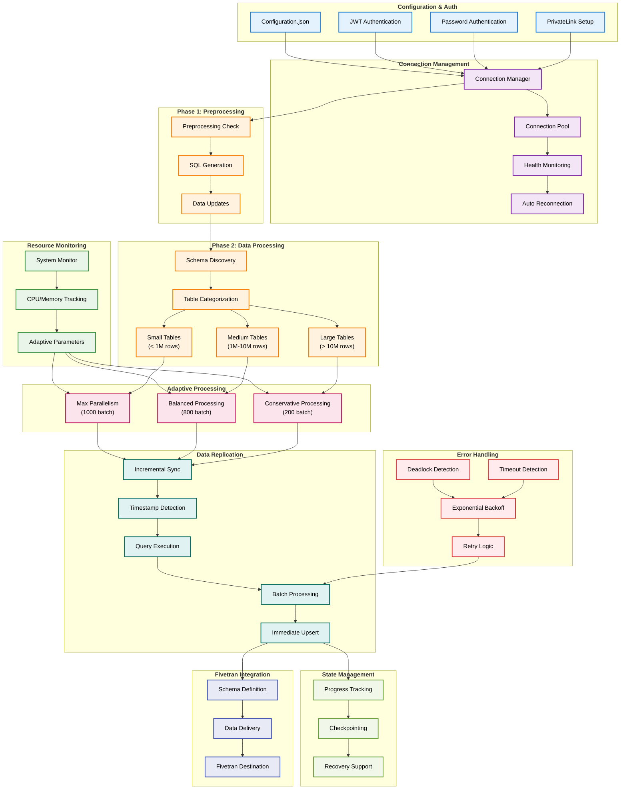

# Snowflake connector SDK with adaptive processing

This connector provides enterprise-ready Snowflake data ingestion with comprehensive optimization techniques, error handling, and resource management. It's designed for high-volume production environments with complex data processing requirements.

## Architecture overview

The following diagram shows the logical flow and architecture of the Snowflake connector with adaptive processing:



## Connector overview

The Snowflake connector with adaptive processing is a high-performance data integration solution that connects to Snowflake databases and replicates data to Fivetran destinations. It features intelligent resource management, automatic error recovery, and adaptive processing strategies that optimize performance based on table size and system resources.

This connector is specifically optimized for:
- High-volume data processing with memory management
- AI/ML data pipelines with complex data structures
- Enterprise environments requiring reliability and scalability
- Time-series data with intelligent timestamp detection
- Large datasets with adaptive batch processing

## Requirements

- [Supported Python versions](https://github.com/fivetran/fivetran_connector_sdk/blob/main/README.md#requirements)   
- Operating system:
  * Windows: 10 or later (64-bit only)
  * macOS: 13 (Ventura) or later (Apple Silicon [arm64] or Intel [x86_64])
  * Linux: Distributions such as Ubuntu 20.04 or later, Debian 10 or later, or Amazon Linux 2 or later (arm64 or x86_64)

## Getting started

Refer to the [Setup Guide](https://fivetran.com/docs/connectors/connector-sdk/setup-guide) to get started.

## Features

* **Adaptive processing** - Automatically adjusts batch sizes, thread counts, and processing strategies based on table size and system resources
* **Memory optimization** - Processes records immediately without accumulating them in memory to prevent overflow
* **Advanced error handling** - Automatic recovery from deadlocks, timeouts, and connection issues with exponential backoff
* **Resource monitoring** - Real-time CPU and memory monitoring with automatic parameter adjustment
* **Incremental sync** - Intelligent timestamp detection for efficient incremental data replication
* **Preprocessing capabilities** - Data transformation and cleaning before replication
* **Enterprise security** - JWT authentication, PrivateLink support, and SSL/TLS configuration
* **Thread-safe operations** - Concurrent processing support for high-performance environments
* **Checkpointing** - Progress saving for recovery and resumption of large sync operations

## Configuration file

The connector uses a `configuration.json` file to define connection parameters and processing options. Here's an example configuration:

```json
{
  "snowflake_user": "your_username",
  "snowflake_password": "your_password",
  "snowflake_account": "your_account",
  "snowflake_warehouse": "your_warehouse",
  "snowflake_database": "your_database",
  "snowflake_schema": "your_schema",
  "tables": "CUSTOMERS,ORDERS,PRODUCTS",
  "use_privatelink": "false",
  "ssl_verify": "true",
  "batch_delay_ms": "100",
  "max_retries": "3",
  "enable_resource_monitoring": "true",
  "enable_preprocessing": "false",
  "preprocessing_table": "",
  "preprocessing_sql": ""
}
```

### Configuration parameters

#### Required parameters
- `snowflake_user` - Your Snowflake username
- `snowflake_password` - Your Snowflake password (for password authentication)
- `snowflake_account` - Your Snowflake account identifier
- `snowflake_warehouse` - Snowflake warehouse name
- `snowflake_database` - Database name to connect to
- `snowflake_schema` - Schema name to sync from

#### Optional parameters
- `tables` - Comma-separated list of tables to sync (default: "CUSTOMERS")
- `use_privatelink` - Set to "true" for PrivateLink connections
- `privatelink_host` - PrivateLink hostname (required if use_privatelink is true)
- `ssl_verify` - Enable SSL verification (default: "true")
- `batch_delay_ms` - Delay between batches in milliseconds (default: "100")
- `max_retries` - Maximum retry attempts for failed operations (default: "3")
- `enable_resource_monitoring` - Enable system resource monitoring (default: "true")
- `enable_preprocessing` - Enable data preprocessing before replication (default: "false")
- `preprocessing_table` - Comma-separated list of tables that need preprocessing
- `preprocessing_sql` - SQL statements to execute before replication

#### JWT Authentication parameters
- `private_key` - Private key for JWT authentication
- `private_key_password` - Password for private key (optional)
- `snowflake_role` - Snowflake role for JWT authentication (optional)

NOTE: Ensure that the `configuration.json` file is not checked into version control to protect sensitive information.

## Requirements file

The `requirements.txt` file specifies the Python libraries required by the connector:

```
snowflake-connector-python
cryptography
psutil
```

NOTE: The `fivetran_connector_sdk:latest` and `requests:latest` packages are pre-installed in the Fivetran environment. To avoid dependency conflicts, do not declare them in your `requirements.txt`.

## Authentication

The connector supports two authentication methods:

### Password Authentication
Use your Snowflake username and password for standard authentication. This is the default method when no private key is provided.

### JWT Authentication
For enhanced security, you can use JWT authentication with a private key:

1. Generate a private key in Snowflake
2. Configure the private key in your `configuration.json`
3. Optionally set a `snowflake_role` for role-based access

### PrivateLink Support
For enterprise networks, you can use PrivateLink connections:

1. Set `use_privatelink` to "true"
2. Provide the `privatelink_host` (e.g., "xz32.east-us-2.privatelink.snowflakecomputing.com")
3. The connector will automatically use PrivateLink for secure connectivity

## Data handling

The connector processes data through several stages:

### Schema Discovery
- Automatically detects table schemas and column types
- Handles schema evolution and dynamic column changes
- Supports both uppercase and lowercase column names

### Adaptive Processing
- **Small tables** (<1M rows): Maximum parallelism with large batches
- **Medium tables** (1M-10M rows): Balanced processing with medium batches  
- **Large tables** (10M+ rows): Conservative processing with smaller batches

### Data Transformation
- Flattens nested JSON structures for AI/ML data
- Converts data types to Fivetran-compatible formats
- Handles timestamp detection and incremental sync
- Processes records immediately to prevent memory overflow

### Memory Management
- Uses `cursor.fetchmany()` for batch processing
- Processes each record individually with `op.upsert()`
- No memory accumulation patterns
- Automatic resource monitoring and adjustment

## Error handling

The connector implements comprehensive error handling strategies:

### Connection Management
- **Deadlock Detection** - Refer to `class DeadlockError` and `_is_deadlock_error()` method
- **Timeout Handling** - Refer to `class TimeoutError` and `_is_timeout_error()` method
- **Automatic Reconnection** - Refer to `ConnectionManager.get_cursor()` context manager
- **Exponential Backoff** - Refer to `retry_with_backoff()` function

### Resource Monitoring
- **Memory Pressure** - Refer to `should_reduce_batch_size()` function
- **CPU Pressure** - Refer to `should_reduce_threads()` function
- **System Monitoring** - Refer to `monitor_resources()` function

### Recovery Strategies
- Automatic retry with exponential backoff
- Connection renewal for transient issues
- Graceful degradation under resource pressure
- Checkpointing for progress recovery

## Tables Created

The connector creates tables based on your configuration. Each table includes:

- `_fivetran_id` - Fivetran-generated surrogate key
- `_fivetran_synced` - Timestamp of last sync
- All original columns from your Snowflake tables
- Flattened nested data structures (if applicable)

### Example Schema
```
CUSTOMERS
├── _fivetran_id (STRING)
├── _fivetran_synced (TIMESTAMP)
├── customer_id (INTEGER)
├── customer_name (STRING)
├── email (STRING)
└── created_at (TIMESTAMP)
```

## Additional considerations

The examples provided are intended to help you effectively use Fivetran's Connector SDK. While we've tested the code, Fivetran cannot be held responsible for any unexpected or negative consequences that may arise from using these examples. For inquiries, please reach out to our Support team.

### Performance Optimization Tips

- **Table Ordering** - The connector processes small tables first, then medium, then large for optimal performance
- **Resource Monitoring** - Enable resource monitoring for automatic parameter adjustment
- **Batch Sizing** - The connector automatically adjusts batch sizes based on table size and system resources
- **Memory Management** - The connector is optimized to prevent memory overflow in high-volume scenarios

### Troubleshooting

- **Connection Issues** - Check your network connectivity and authentication credentials
- **Memory Issues** - Enable resource monitoring and consider reducing batch sizes
- **Timeout Issues** - Increase timeout values for large tables or slow networks
- **Deadlock Issues** - The connector automatically handles deadlocks with retry logic

### Enterprise deployment

This connector is designed for enterprise environments and includes:
- Comprehensive error handling and recovery
- Resource monitoring and automatic adjustment
- Security features including JWT authentication and PrivateLink support
- Scalability features for high-volume data processing
- Detailed logging and monitoring capabilities
