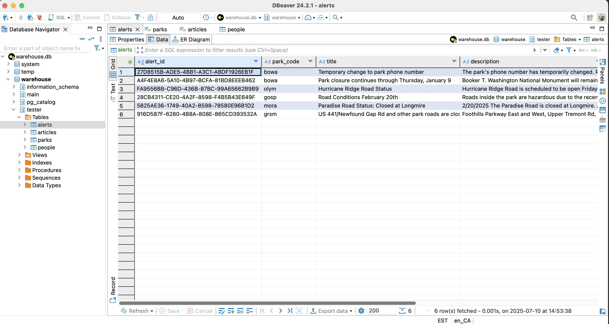
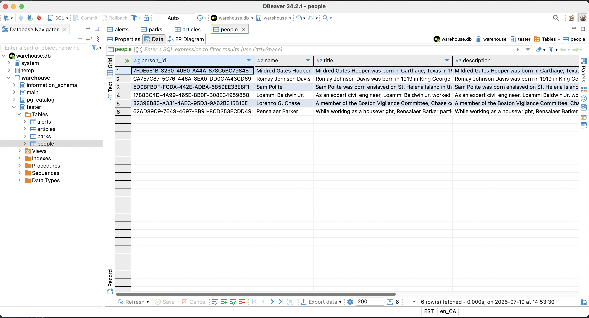

# National Parks Example

This example implements a connector to fetch, process, and store data from the [National Parks Service API (NPS API)](https://www.nps.gov/subjects/developer/index.htm). The process is built with the Object-Oriented Programming (OOP) approach, ensuring modular, maintainable, and reusable code. 

---

## Overview

This example retrieves data from the **NPS API**, processes it, and stores it in a structured format across four tables:  
- Parks
- Alerts
- Articles
- People

Each table is encapsulated within its own Python file, ensuring single responsibility and clean organization.

The project follows a modular architecture:
- Each table has its own dedicated class for handling schema definitions and data transformations.
- A centralized NPS Client handles API interactions, abstracting away the complexities of HTTP requests.

---

## Features

- Modular Design - each table and the API client are encapsulated in separate files for clarity and reusability
- Scalability - you can easily extend it to accommodate additional tables or API endpoints
- Customizability - you can modify transformations or table structures without affecting unrelated components
- Reliability - includes error handling for API interactions and data processing

---

## Project Structure

```plaintext
├── parks.py         # Handles the Parks table
├── alerts.py        # Handles the Alerts table
├── articles.py      # Handles the Articles table
├── people.py        # Handles the People table
├── nps_client.py    # Handles API initialization and data fetching
├── requirements.txt # Lists dependencies
├── README.md        # Project documentation
└── connector.py     # Main file to run the connector
```


## Run the Connector

```bash
Run fivetran debug 
```

## Output

### Parks

This table contains detailed information about national parks


#### Interact with Parks table

Run the following query:

```sql

select * from parks

```

### Articles

This tables stores educational and informational articles about national parks.


#### Interact with Articles table

Run the following query:

```sql

select * from articles

```

### Alerts

This table captures active alerts for parks.




#### Interact with Alerts table

Run the following query:

```sql

select * from alerts

```
### People

This table lists key figures associated with the parks or their history.



#### Interact with People table

Run the following query:

```sql

select * from people

```


