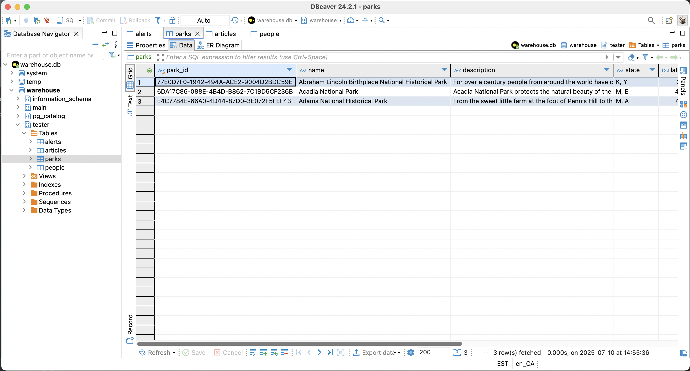

# National Parks Example

This example implements a connector to fetch, process, and store data from the [National Parks Service API (NPS API)](https://www.nps.gov/subjects/developer/index.htm). The process is built based on the Object-Oriented Programming (OOP) approach, ensuring modular, maintainable, and reusable code. 

---

## Overview

This example retrieves data from the NPS API, processes it, and stores it in a structured format across the following tables:  
- `PARKS`
- `ALERTS`
- `ARTICLES`
- `PEOPLE`

Each table is encapsulated within its own Python file, ensuring single responsibility and clean organization.

The project follows a modular architecture:
- Each table has its own dedicated class for handling schema definitions and data transformations.
- A centralized NPS Client handles API interactions, abstracting away the complexities of HTTP requests.

---

## Requirements

* [Supported Python versions](https://github.com/fivetran/fivetran_connector_sdk/blob/main/README.md#requirements)   
* Operating system:
  * Windows: 10 or later (64-bit only)
  * macOS: 13 (Ventura) or later (Apple Silicon [arm64] or Intel [x86_64])
  * Linux: Distributions such as Ubuntu 20.04 or later, Debian 10 or later, or Amazon Linux 2 or later (arm64 or x86_64)

---

## Getting started

Refer to the [Setup Guide](https://fivetran.com/docs/connectors/connector-sdk/setup-guide) to get started.

---

## Features

- Modular design - each table and the API client are encapsulated in separate files for clarity and reusability
- Scalability - you can easily extend it to accommodate additional tables or API endpoints
- Customizability - you can modify transformations or table structures without affecting unrelated components
- Reliability - includes error handling for API interactions and data processing
- State - does not use incremental sync; all data is fetched and upserted on every sync.”

---
## Configuration file

The example expects a configuration.json file with the following structure:

```plaintext
{"api_key": "<YOUR_API_KEY>"}
```

Note: Ensure that the configuration.json file is not checked into version control to protect sensitive information.

---

## Authentication

The example uses a simple API-key authentication. It reads your NPS API key out of a configuration.json file and then includes it on every request as a query parameter.

---
## Pagination

This example does not use any pagination. 

---
## Data handling

- Schema definition: The connector’s tables and their column schemas are built in the schema(configuration) function (see lines 13–18).
- Data retrieval & processing: On each sync, Fivetran calls update(configuration, state) (see lines 22–27), which instantiates each table handler and calls its process_data() method. Under the hood, process_data() uses the shared fetch_data() helper to pull JSON from the NPS API and then maps it into Python dicts.
- Upsert delivery: For every record returned by process_data(), the connector performs an op.upsert(table.path(), row) operation—handing each row off to Fivetran for insert/update in the destination (see lines 24–27).
- Sync: This example does not use incremental syncs; all data is fetched and upserted on every sync.

---

## Run the connector locally

Run the following command to run your connector locally:

```bash
fivetran debug 
```

## Tables created

### PARKS table

The `PARKS` table contains detailed information about national parks.



#### Query the PARKS table

Run the following query:

```sql

select * from parks

```

### ARTICLES table

The `ARTICLES` table stores educational and informational articles about national parks.


#### Query the ARTICLES table

Run the following query:

```sql

select * from articles

```

### ALERTS table

The `ALERTS` table captures active alerts for parks.


#### Query the ALERTS table

Run the following query:

```sql

select * from alerts

```
### PEOPLE table

The `PEOPLE` table lists key figures associated with parks or their history.


#### Query the PEOPLE table

Run the following query:

```sql

select * from people

```

---
## Additional Files

```plaintext
├── parks.py         # Handles the Parks table
├── alerts.py        # Handles the Alerts table
├── articles.py      # Handles the Articles table
├── people.py        # Handles the People table
├── nps_client.py    # Handles API initialization and data fetching
├── requirements.txt # Lists dependencies
├── README.md        # Project documentation
└── connector.py     # Main file to run the connector
```
---

## Additional Considerations

The examples provided are intended to help you effectively use Fivetran's Connector SDK. While we've tested the code, Fivetran cannot be held responsible for any unexpected or negative consequences that may arise from using these examples. For inquiries, please reach out to our Support team.
