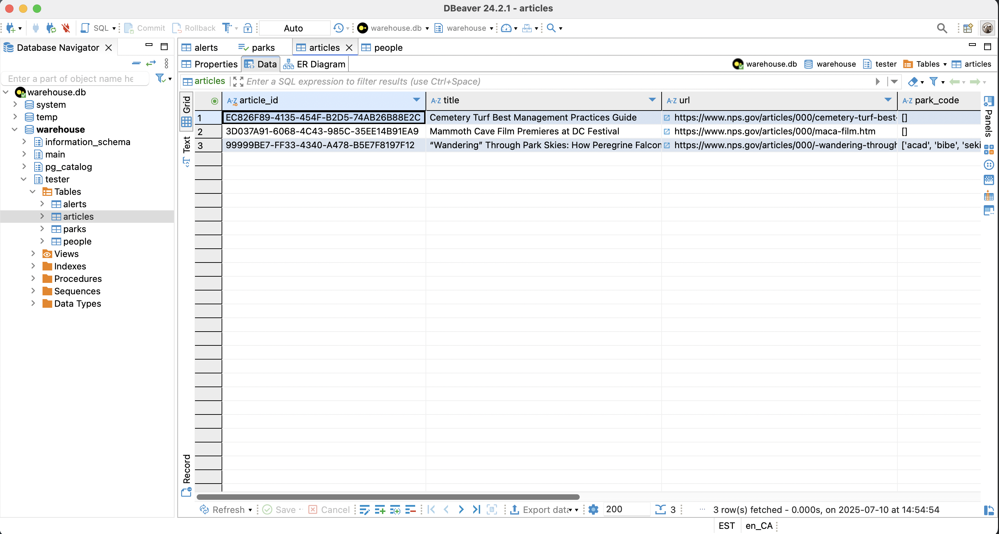

# National Parks Example

This example implements a connector to fetch, process, and store data from the [National Parks Service API (NPS API)](https://www.nps.gov/subjects/developer/index.htm). The process is built based on the Object-Oriented Programming (OOP) approach, ensuring modular, maintainable, and reusable code. 

---

## Overview

This example retrieves data from the NPS API, processes it, and stores it in a structured format across the following tables:  
- `PARKS`
- `ALERTS`
- `ARTICLES`
- `PEOPLE`

Each table is encapsulated within its own Python file, ensuring single responsibility and clean organization.

The project follows a modular architecture:
- Each table has its own dedicated class for handling schema definitions and data transformations.
- A centralized NPS Client handles API interactions, abstracting away the complexities of HTTP requests.

---

## Requirements

* [Supported Python versions](https://github.com/fivetran/fivetran_connector_sdk/blob/main/README.md#requirements)   
* Operating system:
  * Windows: 10 or later (64-bit only)
  * macOS: 13 (Ventura) or later (Apple Silicon [arm64] or Intel [x86_64])
  * Linux: Distributions such as Ubuntu 20.04 or later, Debian 10 or later, or Amazon Linux 2 or later (arm64 or x86_64)

---

## Getting started

Refer to the [Setup Guide](https://fivetran.com/docs/connectors/connector-sdk/setup-guide) to get started.

---

## Features

- Modular design - each table and the API client are encapsulated in separate files for clarity and reusability
- Scalability - you can easily extend it to accommodate additional tables or API endpoints
- Customizability - you can modify transformations or table structures without affecting unrelated components
- Reliability - includes error handling for API interactions and data processing

---

## Project structure

```plaintext
├── parks.py         # Handles the Parks table
├── alerts.py        # Handles the Alerts table
├── articles.py      # Handles the Articles table
├── people.py        # Handles the People table
├── nps_client.py    # Handles API initialization and data fetching
├── requirements.txt # Lists dependencies
├── README.md        # Project documentation
└── connector.py     # Main file to run the connector
```

---

## Run the connector locally

Run the following command to run your connector locally:

```bash
fivetran debug 
```

## Tables created

### PARKS table

The `PARKS` table contains detailed information about national parks.


#### Query the PARKS table

Run the following query:

```sql

select * from parks

```

### ARTICLES table

The `ARTICLES` table stores educational and informational articles about national parks.



#### Query the ARTICLES table

Run the following query:

```sql

select * from articles

```

### ALERTS table

The `ALERTS` table captures active alerts for parks.


#### Query the ALERTS table

Run the following query:

```sql

select * from alerts

```
### PEOPLE table

The `PEOPLE` table lists key figures associated with parks or their history.


#### Query the PEOPLE table

Run the following query:

```sql

select * from people

```


