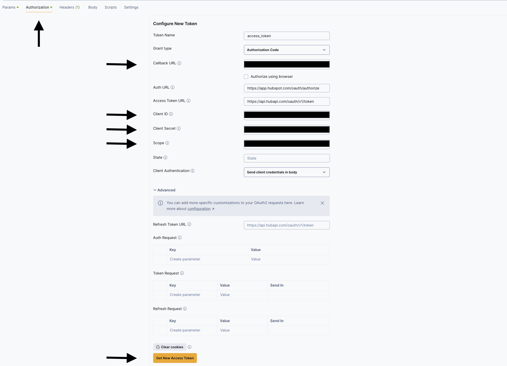
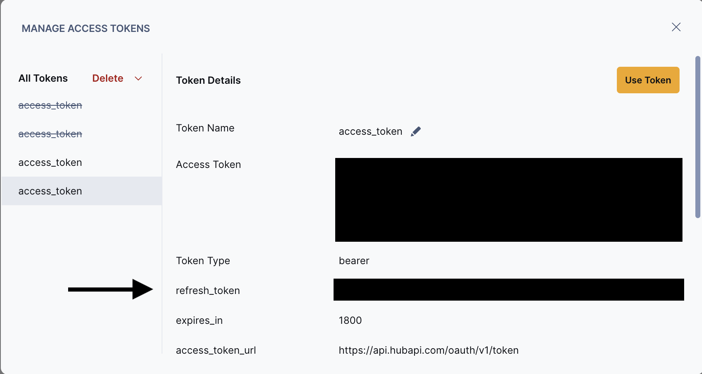

# OAuth2 Refresh Token Hubspot Connector Example

> NOTE: We have Fivetran connector for HubSpot that users can integrate directly on the dashboard [here](https://fivetran.com/docs/connectors/applications/hubspot#hubspot). You can use this example as a reference for the cases where you want to connect to a custom OAuth2 source that requires access token refresh.

## Prerequisites

1. If you don't have a HubSpot account, follow HubSpot's [instructions](https://developers.hubspot.com/docs/guides/apps/public-apps/overview) to create one.

2. Create a developer account and a HubSpot app with scopes and redirect URL. See HubSpot's [OAuth documentations](https://developers.hubspot.com/docs/reference/api/app-management/oauth) for details.

3. Use this above credentials in Postman inside Authroization->OAuth2.0 as shown in the below ss:
     

4. Fetch the Refresh Token:
    1. Clicking on the `Get new access Token` button, you will be redirected on a browser signup popup.
    1. Log in with your dev account, and grant access. The popup will close and you should see the following window with tokens.
      


5. Access the [HubSpot API collection](https://developers.hubspot.com/docs/reference/api/crm/objects).

## Debug

1. Once you have the refresh token, client secret, and ID, replace them in the `configuration.json` file.
2. Run the `main` function to trigger the `debug` command and start syncing your code to your local machine.

## Deploy the connector

1. Get your base64 Fivetran API key in your [Fivetran dashboard](https://fivetran.com/dashboard/user/api-config)

2. [Create a destination](https://fivetran.com/dashboard/destinations) in the Fivetran dashboard.

3. Use the following command in the folder containing the `connector.py` file to deploy the connector:

     ```bash
     python connector.py --api-key <FIVETRAN-API-KEY> --destination <DESTINATION-NAME> --connection <CONNECTION-NAME> --configuration configuration.json
     ```
4. Once you have deployed the connector, follow the link in the terminal or search in the dashboard with the connection name to view the sync status and logs.

> NOTE: This example only supports cases where the refresh token does not have a TTL, and only the access token is refreshed with the refresh token. If you occasionally need to update the refresh token, you can do it in the dashboard and in the connection setup. We will update this example with a similar approach once we support refreshing passed credentials via the connector code.
